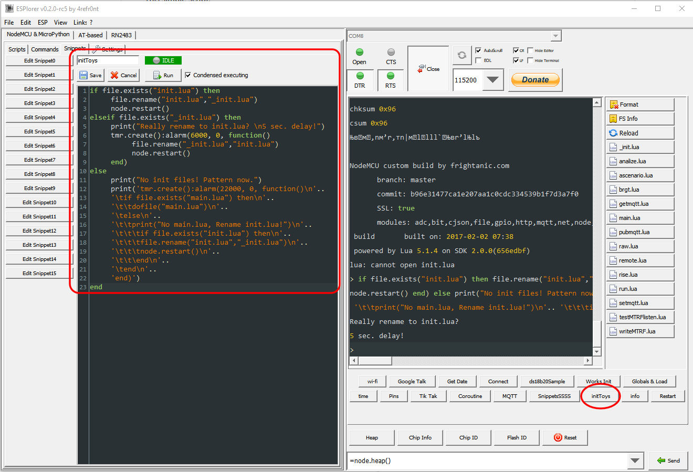

# initToys

This simple script:

renames file "init.lua" to "_init.lua" and send node.restart()

renames file "_init.lua" to "init.lua" and send node.restart()

if no "init.lua" and no "_init.lua" - print "init.lua" frame.

